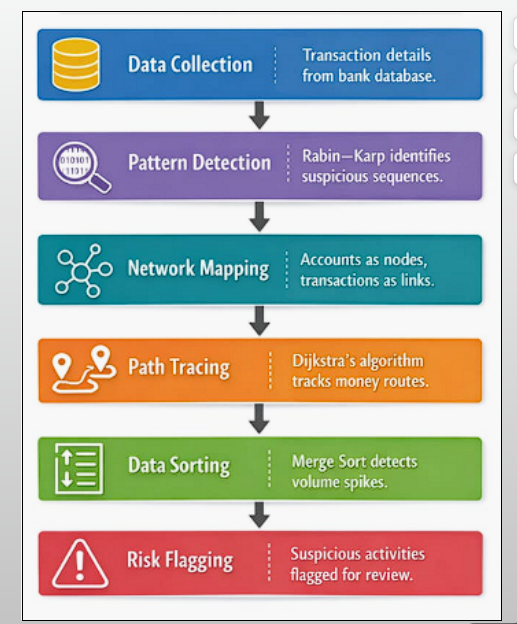

# Project Overview and Details

## Overview
Online banking transactions are increasing rapidly, which also increases the risk of fraud. Manual fraud detection is difficult due to large data volume.

## Problem Statement
To detect suspicious bank transactions by analyzing transaction patterns, money transfer paths, and abnormal transaction spikes.

## Objectives
- Detect repeated suspicious transactions
- Trace unusual money transfer routes
- Identify abnormal transaction amounts
- Apply efficient DAA algorithms

## Dataset Used
PaySim – Synthetic Financial Transaction Dataset

## Stakeholders
- Banks
- Customers
- Fraud Detection Teams
- Regulatory Authorities

# Individual Reflection

This project helped us to understand how algorithms can be applied to real-world banking problems. we have  learned how to analyze algorithm efficiency, handle large datasets, and design a practical fraud detection system. The project improved our problem-solving and implementation skills.
